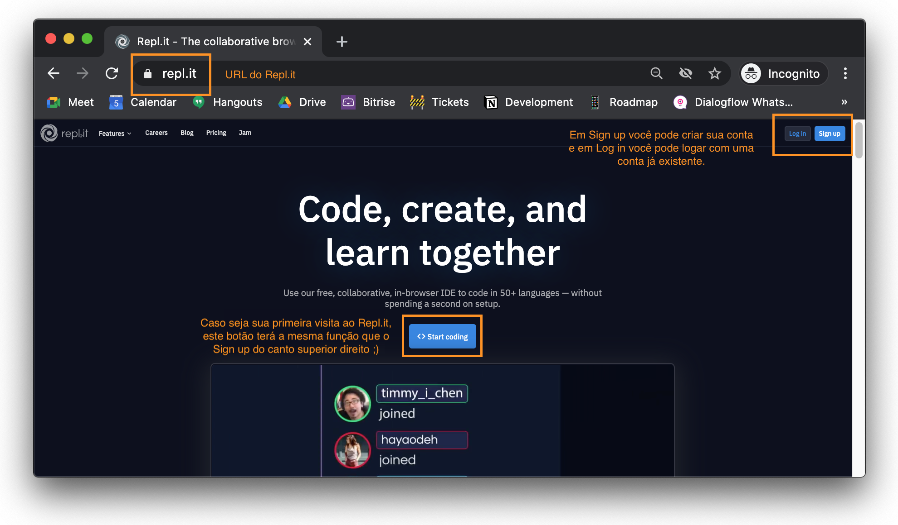
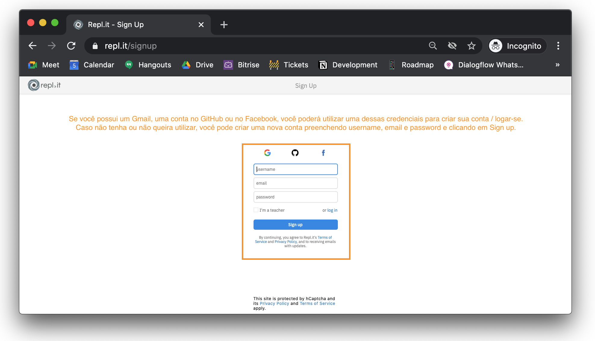
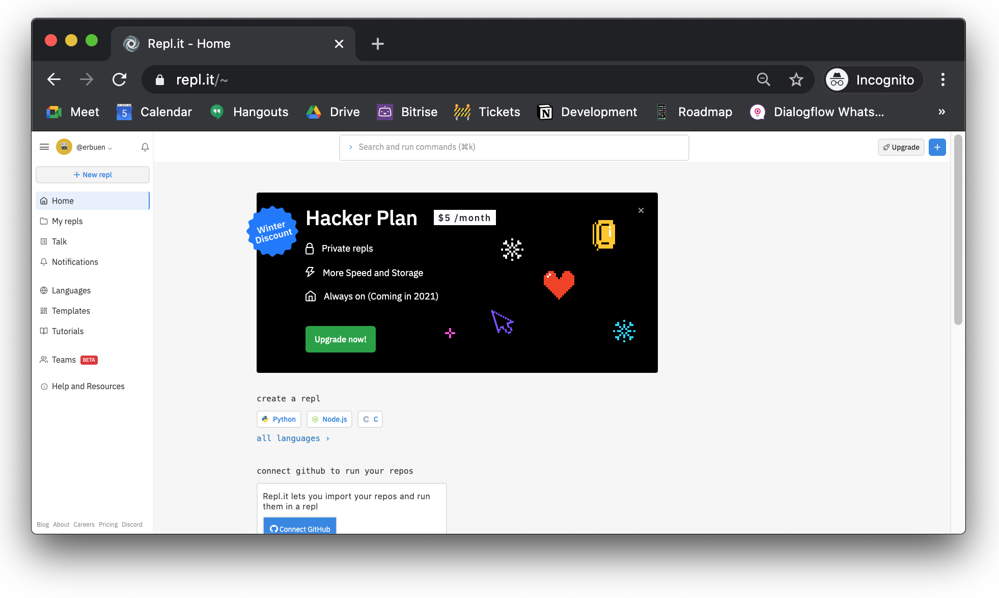
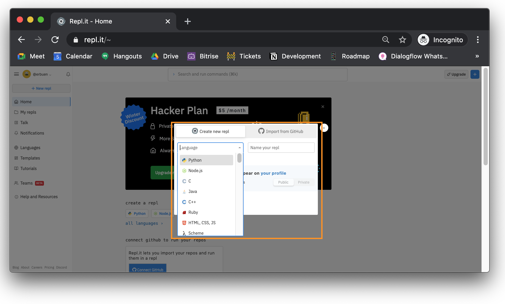
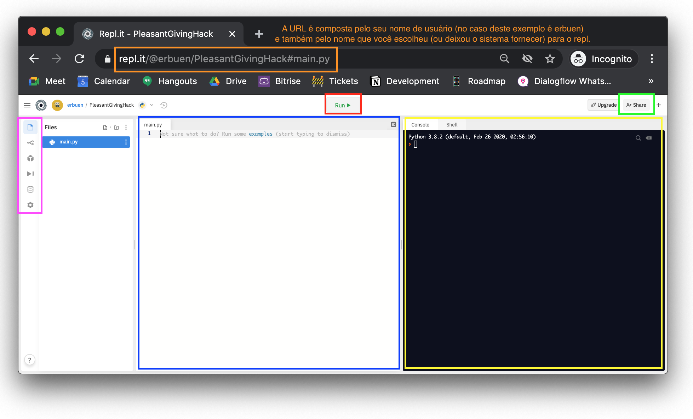
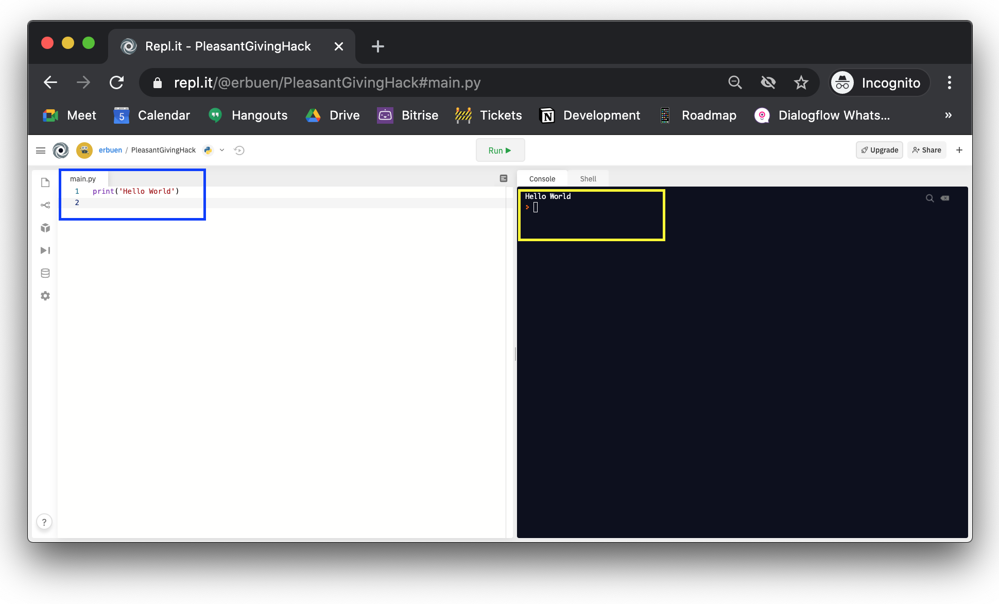
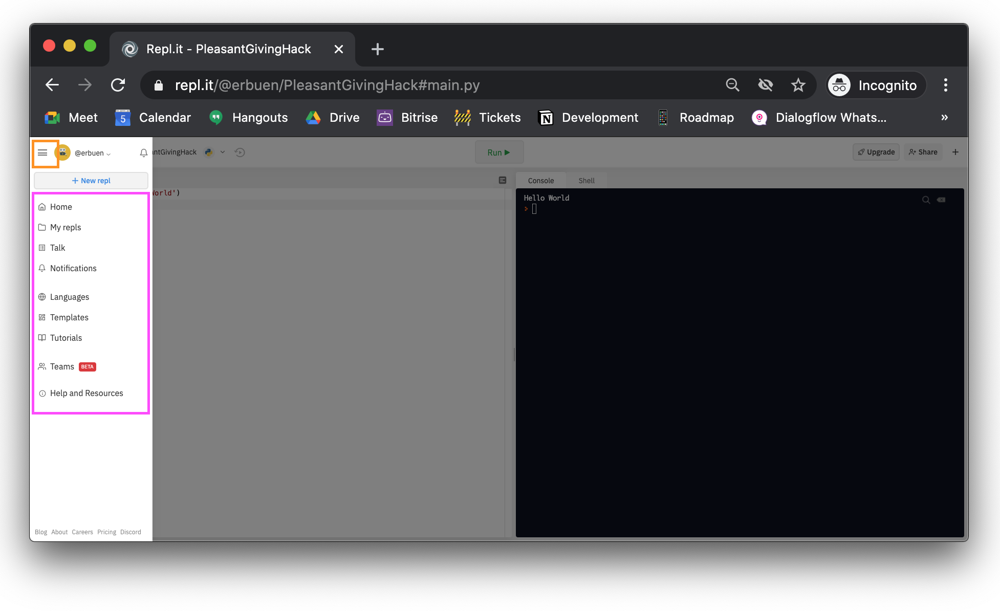

# Como utilizar o Repl

Neste arquivo, você encontrará instruções detalhadas sobre como utilizar o Repl.it, a IDE online que utilizaremos ao longo do curso.

## O que é uma IDE?

IDE é a sigla para *Integrated Development Environment* que, em português, significa Ambiente de Desenvolvimento Integrado.

Para escrever um texto comum como um relatório ou trabalho da faculdade, utilizamos editores de texto como o Word, o Pages ou o Google Docs, certo?

Pois bem, para escrever código nós não podemos utilizar esse tipo de editor. Precisamos de um editor especial com funcionalidades específicas para essa finalidade. A IDE é justamente aquilo que precisamos pois é possível escrever, compilar, executar e debugar (ou depurar) o seu código no mesmo lugar.

Você pode encontrar mais informações [aqui](https://pt.wikipedia.org/wiki/Ambiente_de_desenvolvimento_integrado) e também [aqui](https://blog.betrybe.com/tecnologia/ide/).

## O que é o Repl.it?

É um serviço online que funciona como IDE, compilador, interpretador, nuvem e comunidade. 

Você pode escrever, compilar, executar e debugar seus códigos em diversas linguagens; pode compartilhar seu código com outras pessoas facilmente; pode codar junto com outra pessoa; pode pesquisar tutorais na comunidade, etc.

A maioria das funcionalidades do Repl.it é gratuita e, para o que vamos utilizar ao longo do curso, basta que você crie a sua conta gratuita mesmo ;)

## Como criar sua conta no Repl.it?

Passo 1 - Acesse www.repl.it.



Passo 2 - Clique em Start coding ou Sign up.



Passo 3 - **Alternativa 1 (recomendável):** Você pode utilizar um Gmail, uma conta no GitHub ou no Facebook para criar sua conta. Para isso, clique no logo correspondente e faça o login. **Alternativa 2:** Você pode preencher os campos username, email e password e clicar em Sign up.

**Importante:** Caso você tenha optado pela alternativa 2, verifique sua caixa de entrada. Você receberá um e-mail para confirmar a criação da sua conta.

## Utilizando o Repl.it 

Depois de criar sua conta e após logar-se, você verá algo bem parecido com isso:



Eventualmente pode existir um ou outro elemento diferente. Por exemplo, talvez você não esteja visualizando esse anúncio referente ao Hacker Plan e/ou esteja vendo algum anúncio diferente. Mesmo assim, as características da home do Repl.it, uma vez que a pessoa esteja logada, são as mesmas.

As características mais importantes são o menu à esquerda e o botão + no canto superior direito.

Vamos começar pelo botão +. A função dele é criar um novo repl para você, então, quando clicar nele, o que você verá na tela é algo parecido com isso:



Esta caixinha serve para que possamos escolher a linguagem que nosso repl terá. No caso do curso, será sempre Python. Caso você esteja estudando outras linguagens, fique à vontade para explorar 🧡

Depois de escolher a linguagem, podemos dar um nome ao repl. Caso você não escolha um nome, o próprio serviço dará um nome automático.

Não escolherei um nome para este repl, então perceba que o sistema já deu um nome aleatório para ele: *PleasantGivingHack*.

Uma vez escolhida a linguagem e o nome, clique em Create repl.

Você verá algo assim:



Note que a URL do seu repl - que é única - fica totalmente relacionada ao seu username e ao nome escolhido no momento da criação do repl.

Começando pelo lado esquerdo, temos o menu (destaque em rosa). Conforme você clica nos ícones, a área imediatamente à direita dele vai mudando. Como o ícone Files está selecionado, você está visualizando os arquivos do repl. Neste caso, há apenas um, o **main.py**.

Na ordem, os ícones são:
- Files (arquivos)
- Version control (controle de versão)
- Packages (pacotes)
- Debug (depuração)
- Database (banco de dados)
- Settings (configurações)

Clicando em Settings, vamos configurar o tamanho da indentação na opção Indent size (configurar para 4) e vamos desabilitar a inteligência de código em Code intelligence (configurar para disabled).

Pronto! É só selecionar as opções que elas ficam automaticamente salvas!

Existe uma divisória que delimita o menu e os limites da área destacada em azul. Ao clicar no marcador existente nessa divisória (fica no meio, em cinza mais escuro) e segurar o clique, você pode arrastar essa divisória para esquerda até ela desaparecer, deixando somente a área destacada em azul correspondente ao conteúdo do arquivo main.py e a área destacada em amarelo.

A área destacada em azul é o conteúdo do arquivo *main.py*. Note que na primeira linha desta área há o número 1. Quando mais coisas você digitar ali, mais linhas numeradas surgirão. Nós costumamos utilizar essa numeração para fazer referência ao código, especialmente quando precisamos consertar alguma coisa!

A área destacada em amarelo é o console onde podemos visualizar a saída dos nossos futuros códigos (o resultado de uma conta, uma informação, etc.) e também onde poderemos inserir informações necessárias para a execução do código (o nome de um usuário, uma data, notas de alunes, etc.).

O botão destacado em verde, Share, serve para que possamos compartilhar nosso repl com outras pessoas. Via de regra, elas podem visualizar.

E, por fim, o botão destacado em vermelho, Run, será utilizado na próxima seção 😉

## Escrevendo nosso primeiro código

Vamos fazer um teste rápido aqui para demonstrar como o repl realmente funciona 😄

No arquivo main.py, na primeira linha, digite a seguinte instrução:

```python
print('Hello World')
```

Em seguida, clique no botão Run. Você provavelmente está vendo algo assim:



De um lado, você tem o seu código. Tudo bem que é apenas uma única linha, mas é um código 💜

E, do outro, após clicar em Run, você tem o resultado dele. O comando *print* exibe na tela o conteúdo que foi passado entre parênteses, no caso, a expressão *Hello World*.

Quando você digita esse código (destaque azul) e clica em Run, ele é executado e, por isso, no console (destaque amarelo), você está vendo *Hello World* 🤩

Ao longo do curso, vamos escrever muitos códigos. Através do console, poderemos interagir com ele inserindo informações e obtendo resultados.

## Onde meus repls ficam salvos?

Sempre que quiser acessar seus repls, clique no menu hamburguer localizado no canto superior esquerdo da tela e você verá o menu, o mesmo que aparecia na home (lembra?).



Selecionando a opção My repls, você terá acesso a todos os repls que você criou.

Por padrão, eles serão salvos em uma pasta chamada *Unnamed (X)* onde X mostrará o número de repls que existem dentro da pasta.

Você poderá criar outras pastas, mover seus repls, excluir, etc. É um mecanismo muito parecido com o Google Drive ou até mesmo com o gerenciador de arquivos do seu sistema operacional.

**Importante:** Todos os seus repls são públicos. A conta gratuita **não** dá direito a ter repls privados. Sendo assim, nunca coloque informações sensíveis nos seus códigos porque ficarão visíveis a outras pessoas que utilizam o Repl.it 😉
